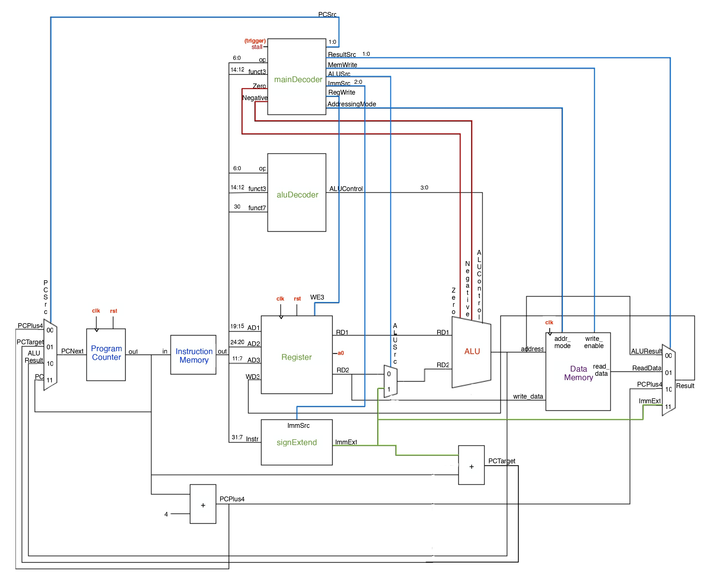
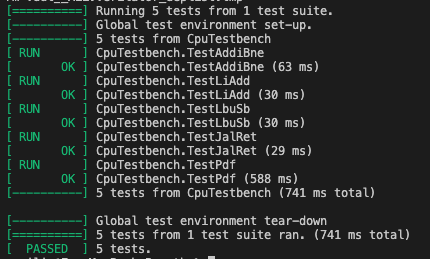
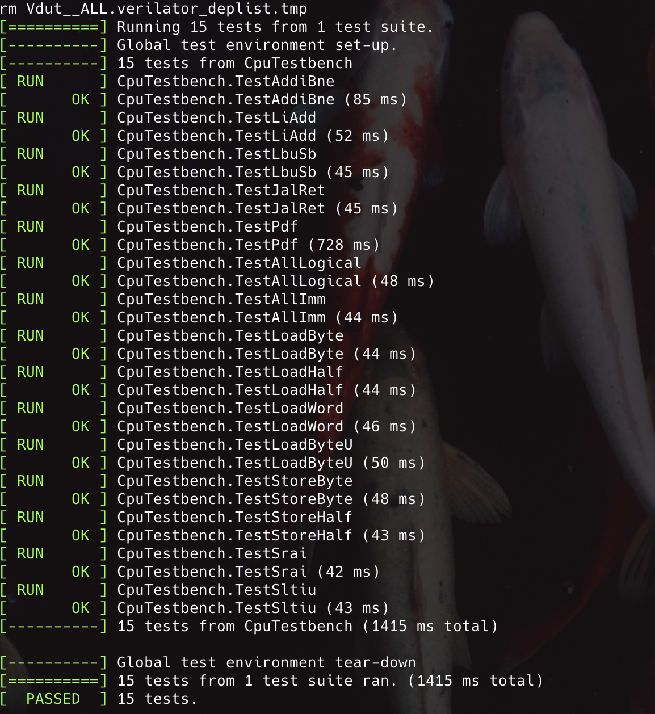
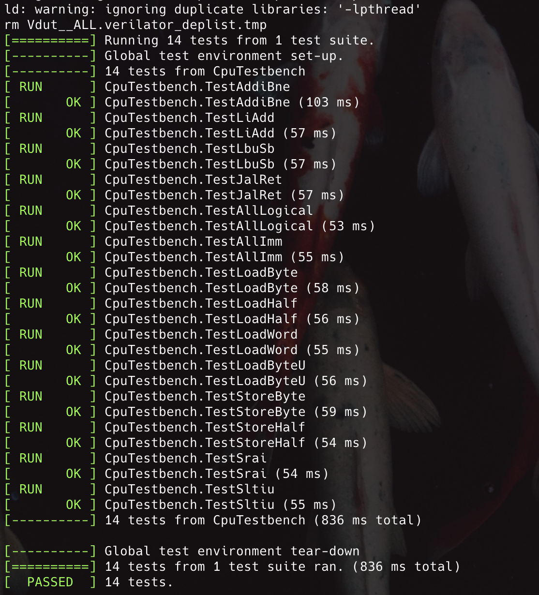

## Introduction

This project implements a fully-featured RV32I RISC-V processor, developed as part of the EIE2 IAC design project.

## Branch Structure

- `main` - Full single-cycle RV32I CPU
- `pipeline` - 5-stage pipelined CPU with full hazard detection and handling for data and control hazards
- `cache` - Full RV32I design with 2 way set associate, 4 word block size, write-back cache
- `branch_prediction` - 2 bit dynamic branch prediction implementation on pipelined CPU

## Testbench Infrastructure

All branches support the full RV32I instruction set and are validated using a shared testbench suite, including unit tests, integration tests, and full application workloads such as the F1 Starting Lights and pdf program with Vbuddy. The testbench is organised to support incremental debugging and full execution. 

### Testbench Directory Structure

```jsx
tb/
├── asm/                # Assembly test programs
├── c/                  # C test cases
├── reference/          # Reference PDF program 
├── test_out/           # Output from each test
├── tests/              # Full CPU integration testbench
├── unit_tests/         # Unit testbenches
├── vb-f1_test/         # VBuddy visual test (F1 lights)
├── vb-pdf_test/        # VBuddy visual test (PDF)
├── assemble.sh         # Assembler script
├── doit.sh             # Script to run full integration test 
├── unit.sh             # Script to run unit tests
└── verification.md

```

The directory provides three helper scripts:

- `assemble.sh` which converts assembly (`.s`) to machine code (`program.hex`)
- `doit.sh` which runs all integration tests on the full CPU
- `unit.sh` which runs all module-level unit tests

### How to run the tests

To run all integration tests

```jsx
cd tb
chmod +x assemble.sh
chmod +x doit.sh
./doit.sh
```

To run module-level unit tests

```jsx
cd tb
chmod +x unit.sh
./unit.sh <modulename_tb.cpp>
```

### Running tests on Vbuddy

First, ensure Vbuddy is connected and configured with `tb/vbuddy.cfg`

1. F1 FSM

```jsx
cd tb/vb-f1_test
chmod +x doit.sh
./dof1.sh
```

1. PDF 

```jsx
cd tb/vb-pdf_test
chmod +x dopdf.sh
./dopdf.sh
```

You can change the PDF input distribution by editing line 20 in `tb/vb-pdf_test/pdf_tb.cpp` 

```jsx
std::string dist = "gaussian";   // "gaussian" or "triangle" or "noisy"
```

### Note:

- Run all scripts from within `tb/`.
- Output for each test will appear in `tb/test_out/<testname>/`.
- All `.hex` files generated by assembly will override `tb/program.hex`.
- The assembly source files live in `tb/asm/`.

## Single-Cycle RV32I Design

This design implements the basic RV32I instruction set.

### Schematic Diagram
<p align="left">  </p><BR>


### Module Breakdown

**Fetch stage**

- `program_counter.sv`
- `instruction_memory.sv`

**Decode Stage**

- `mainDecoder.sv`
- `aluDecoder.sv`
- `register.sv`
- `signExtend.sv`

**Execute Stage**

- `alu.sv`

**Memory Stage**

- `datamemory.sv`

### Instruction Implemented

| **Type** | **Instructions Supported** |
| --- | --- |
| R-Type | `add` `sub` `sll` `slt` `sltu` `xor` `srl` `sra` `or` `and` |
| I-Type (ALU) | `addi` `slli` `slti` `sltiu` `xori` `srli` `srai` `ori` `andi` |
| I-Type (Load) | `lw` `lbu` |
| I-Type (Jump) | `jalr` |
| S-Type (Store) | `sw` `sb` |
| B-Type (Branch) | `beq` `bne` `blt` `bge` `bltu` `bgeu` |
| U-Type | `lui` |
| J-Type | `jal` |

Also supports pseudo instructions (`li` `j` `beqz` `bnez` `snez` `seqz`)

### RTL File Structure

```jsx
rtl/
│
├── decode/                   # Instruction decode stage
│   ├── subControlUnit/
│   │   ├── aluDecoder.sv    
│   │   └── mainDecoder.sv
│   │
│   ├── controlUnit.sv]
│   ├── decode_top.sv                
│   ├── register.sv]  
│   └── signExtend.sv          
│
├── execute/                  # Execute stage
│   ├── alu.sv
│   └── execute_top.sv               
│
├── fetch/                    # Instruction fetch stage
│   ├── fetch_top.sv                 
│   ├── instruction_memory.sv                   
│   └── program_counter.sv        
│
├── memory/                   # Data memory stage
│   ├── datamemory.sv
│   └── memory_top.sv                
│
├── adder.sv
├── mux2.sv
├── mux4.sv
│
└── top.sv                    # Top-level single-cycle CPU integrating all stages
```

### Contribution

| **Task** | **Brandon** | **En Qi** | **Ezekiel** | **Jerry** |
| --- | --- | --- | --- | --- |
| Control Unit |  |  | ✓ |  |
| Sign Extend |  |  | ✓ |  |
| Register File |  |  | ✓ |  |
| ALU | ✓ |  |  |  |
| Instruction Memory |  |  |  |  ✓ |
| Program Counter |  |  |  | ✓ |
| Data Memory | ✓ |  |  |  |
| Overall Integration | ✓ |  | ✓ | ✓ |
| Testbench |  | ✓ |  | ✓ |
| F1 Program |  | ✓ |  |  |

### Integration Test Results

1. All 5 provided tests
    
    <p align="left">  </p><BR>
    
2. F1 Program
   
    <video src="https://github.com/user-attachments/assets/1366c91d-25b0-442d-8088-113d66fe4528" controls></video>
    
3. PDF: Gaussian

   <video src="https://github.com/user-attachments/assets/002a4e5c-43db-4a24-a7dc-ba94e0ccd0cb" controls></video>
   
4. PDF: Noisy

    <video src="https://github.com/user-attachments/assets/ca54a8ce-91c8-4c35-bb90-1e327a5f0466" controls></video>
   
5. PDF: Triangle

    <video src="https://github.com/user-attachments/assets/56c2b421-1848-4d30-9b90-5429c09b96f2" controls></video>

## Pipelined RISC-V CPU

This design extends the single-cycle design into a fully pipelined 5-stage design. The CPU has been tested and it supports the basic instruction set, passes all provided tests, and runs both PDF program and F1 program on Vbuddy successfully.

### Pipeline Architecture

1. Instruction Fetch (IF) - Fetches instructions and PC + 4 from instruction memory
2. Instruction Decode (ID) - Decodes control signals, read registers, generates immediate
3. Execute / ALU / Branch Decision (EX) - Performs ALU operations and evaluates branch or jump conditions
4. Memory Access (MEM) - Handles load or store instruction to data memory
5. Writeback (WB) - Writes results back to the resigner file.

Pipeline resigners separate each stage, capturing operands, immediate, control signals, and results for the next stage. 

### Hazard Handling

We also included a hazard unit that manages all data and control hazards to ensure correct execution.

**Data Hazard (Forwarding)**

To avoid unnecessary stalls, results are forwarded directly to the ALU when needed

- EX/MEM → EX for values produced one cycle earlier
- MEM/WB → EX for values about to be written back

This allows most dependent ALU instructions to execute without stalling.

**Load-Use Hazard**

Load requires one extra cycle before their data becomes available. If the instruction in ID needs a value being loaded in EX, the hazard unit will stall PC and IF/ID, and insert a bubble into ID/EX

**Control Hazard**

Branches and jumps are resolved in the EX stage. If a branch is taken, IF/ID is flushed and PC is updated to the branch target to remove incorrectly fetched instructions on the wrong path. 

### Schematic Diagram
<p align="left">  </p>
*Figure adapted from Harris & Harris,  
Digital Design and Computer Architecture: RISC-V Edition, © Morgan Kaufmann.*


### Testing

The pipelined CPU passed all of our tests.

<p align="left">  </p><BR>

### Contribution

| **Task** | **Brandon** | **En Qi** | **Ezekiel** | **Jerry** |
| --- | --- | --- | --- | --- |
| Pipeline stages | ✓ | ✓ | ✓ | ✓ |
| Hazard Unit | ✓ |  | ✓ |  |
| Testbench | ✓ | ✓ | ✓ | ✓ |
| Testing and Debugging  | | ✓ |  | ✓ 

## Cache 

### Cache Controller Design
The cache controller is designed as a finite state machine (FSM) that manages interactions between the CPU, cache SRAM, and main memory while maintaining correct timing and stalling behaviour. The 5 states are: `IDLE`, `CHECK_TAG`, `ALLOCATE`, `WRITE_BACK`, `REFILL`

- `IDLE`: Entry state that detects a CPU memory request and transitions to tag checking.

- `CHECK_TAG`: Compares request tag against cache tags to determine hit or miss and select the target way. If cache hit, reads data immediately and transitions back to IDLE in the next state. If miss, transitions to ALLOCATE.  

- `ALLOCATE`: Checks whether write-back is required depending on if the way to be evicted is dirty.

- `WRITE_BACK`: Writes the dirty cache line back to main memory one word at a time.

- `REFILL`: Fetches a full cache line from main memory into the selected cache way and updates tag/valid/dirty/LRU.

### Testing

The Cache implementation succesfully passed the the following tests: 

<p align="left">  </p><BR>

### Contribution

| **Task** | **Brandon** | **Jerry** |
| --- | --- | --- |
| SV Implementation | ✓ |  |  |  |
| Testing and Debugging  | | ✓ |


### References
Harris, D. M., & Harris, S. L.  
*Digital Design and Computer Architecture: RISC-V Edition*.  
Morgan Kaufmann, 2021.

