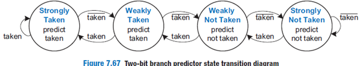
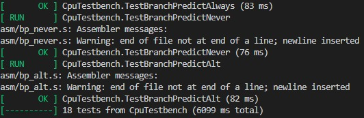
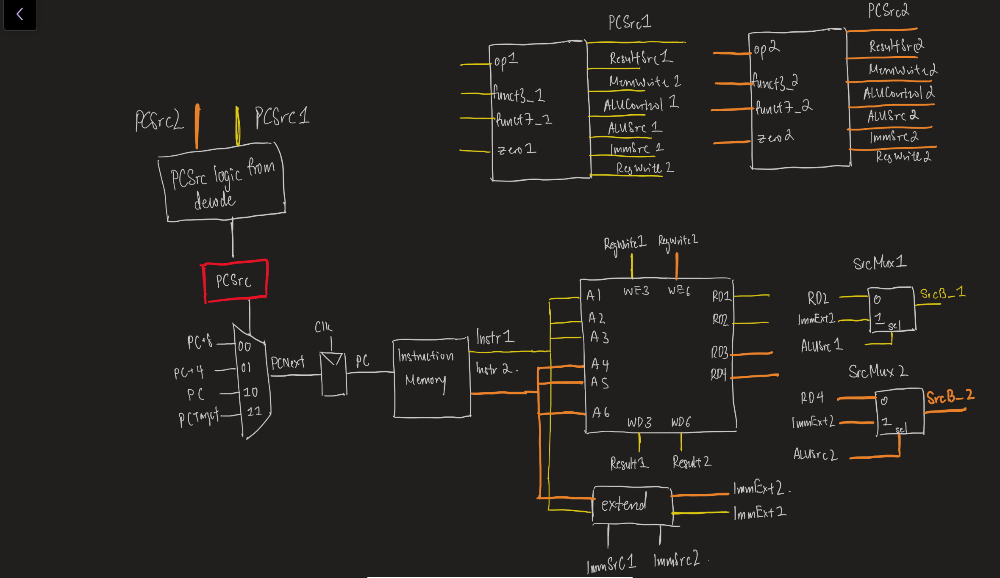
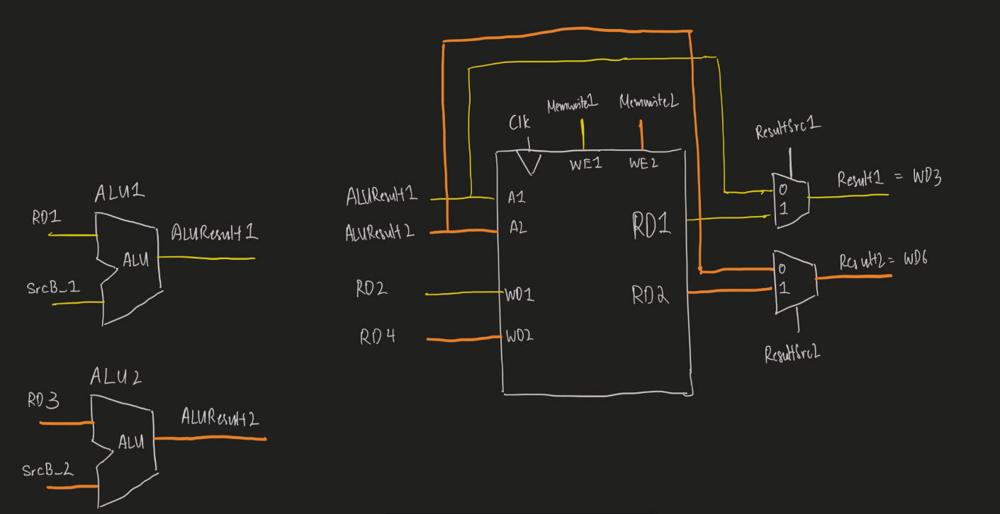
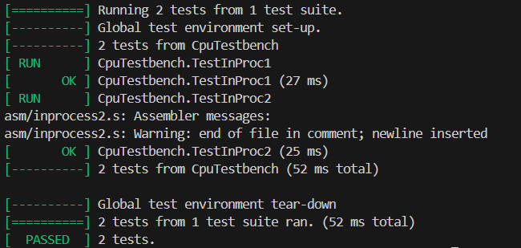
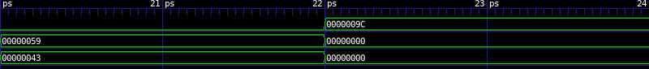

# RISC-V RV32I Processor

## Table of Contents

- [1. Introduction](#1-introduction)
- [2. Branch Structure](#2-branch-structure)
- [3. Testbench Infrastructure](#3-testbench-infrastructure)
  - [3.1 Directory Structure](#31-testbench-directory-structure)
  - [3.2 How to Run the Tests](#32-how-to-run-the-tests)
  - [3.3 Running Tests on Vbuddy](#33-running-tests-on-vbuddy)
- [4. Single-Cycle RV32I Design](#4-single-cycle-rv32i-design)
  - [4.1 Schematic Diagram](#41-schematic-diagram)
  - [4.2 Module Breakdown](#42-module-breakdown)
  - [4.3 Memory Architecture](#43-memory-architecture)
  - [4.4 Instructions Implemented](#44-instructions-implemented)
  - [4.5 RTL File Structure](#45-rtl-file-structure)
  - [4.6 Contribution](#46-contribution)
  - [4.7 Integration Test Results](#47-integration-test-results)
- [5. Pipelined RISC-V CPU](#5-pipelined-risc-v-cpu)
  - [5.1 Pipeline Architecture](#51-pipeline-architecture)
  - [5.2 Hazard Handling](#52-hazard-handling)
  - [5.3 Schematic Diagram](#53-schematic-diagram)
  - [5.4 Testing](#54-testing)
  - [5.5 Contribution](#55-contribution)
- [6. Cache Implementation](#6-cache-implementation)
  - [6.1 Cache Architecture](#61-cache-architecture)
  - [6.2 Address Parsing](#62-address-parsing)
  - [6.3 SRAM Layout](#63-sram-layout)
  - [6.4 Cache Controller FSM](#64-cache-controller-fsm)
  - [6.5 Testing](#65-testing)
  - [6.6 Contribution](#66-contribution)
- [7. Branch Prediction Implementation](#7-branch-prediction-implementation)
  - [7.1 Overview](#71-overview)
  - [7.2 State Encoding](#72-state-encoding)
  - [7.3 State Transitions](#73-state-transitions)
  - [7.4 Indexing](#74-indexing)
  - [7.5 BTB Lookup](#75-btb-lookup)
  - [7.6 Misprediction Detection](#76-misprediction-detection)
  - [7.7 Testing](#77-testing)
  - [7.8 Contribution](#78-contribution)
- [8. In Process Superscalar](#8-in-process-superscalar)
  - [8.1 Overview](#81-overview)
  - [8.2 Implementation](#82-implementation)
  - [8.3 Testing](#83-testing)
  - [8.4 Contribution](#84-contribution)

## 1. Introduction

This project features a RISC-V processor that supports the full RV32I instruction set, developed as part of the EIE2 Instruction Architecture & Compilers Autumn project.

## 2. Branch Structure

- `main` - Full RV32I instruction set single-cycle CPU
- `pipeline` - 5-stage pipelined CPU with full hazard detection and handling for data and control hazards
- `cache` - Full RV32I design with 2-way set associative, 4 word block size, write-back cache
- `branch_prediction` - 2-bit dynamic branch prediction implementation on pipelined CPU
- `superscalar` - Superscaled implementation 

## 3. Testbench Infrastructure

**All branches support the full RV32I instruction set** and are validated using a shared testbench suite, including unit tests, integration tests, and full application workloads such as the F1 Starting Lights and pdf program with Vbuddy. The testbench is organised to support incremental debugging and full execution. 

### 3.1 Testbench Directory Structure

```plaintext
tb/
├── asm/                # Assembly test programs
├── c/                  # C test cases
├── reference/          # Reference PDF program 
├── test_out/           # Output from each test
├── tests/              # Full CPU integration testbench
├── unit_tests/         # Unit testbenches
├── vb-f1_test/         # VBuddy visual test (F1 lights)
├── vb-pdf_test/        # VBuddy visual test (PDF)
├── assemble.sh         # Assembler script
├── doit.sh             # Script to run full integration test 
├── unit.sh             # Script to run unit tests
└── verification.md

```

The directory provides three helper scripts:

- `assemble.sh` which converts assembly (`.s`) to machine code (`program.hex`)
- `doit.sh` which runs all integration tests on the full CPU
- `unit.sh` which runs all module-level unit tests

### 3.2 How to Run the Tests

To run all integration tests:

```bash
cd tb
chmod +x assemble.sh
chmod +x doit.sh
./doit.sh
```

To run module-level unit tests:

```bash
cd tb
chmod +x unit.sh
./unit.sh <modulename_tb.cpp>
```

### 3.3 Running Tests on Vbuddy

First, ensure Vbuddy is connected and configured with `tb/vbuddy.cfg`

1. F1 FSM

```bash
cd tb/vb-f1_test
chmod +x doit.sh
./dof1.sh
```

2. PDF

```bash
cd tb/vb-pdf_test
chmod +x dopdf.sh
./dopdf.sh
```

You can change the PDF input distribution by editing line 20 in `tb/vb-pdf_test/pdf_tb.cpp`:

```cpp
std::string dist = "gaussian";   // "gaussian" or "triangle" or "noisy"
```

### 3.4 Note

- Run all scripts from within `tb/`.
- Output for each test will appear in `tb/test_out/<testname>/`.
- All `.hex` files generated by assembly will override `tb/program.hex`.
- The assembly source files live in `tb/asm/`.

## 4. Single-Cycle RV32I Design

This design implements the full RV32I instruction set.

### 4.1 Schematic Diagram
<p align="left">  </p>

### 4.2 Module Breakdown

**Fetch stage**

- `program_counter.sv`
- `instruction_memory.sv`

**Decode Stage**

- `mainDecoder.sv`
- `aluDecoder.sv`
- `register.sv`
- `signExtend.sv`

**Execute Stage**

- `alu.sv`

**Memory Stage**

- `datamemory.sv`

### 4.3 Memory Architecture

The data memory uses a 17-bit address space (128KB) with byte-addressable memory:
- **Address Range**: `0x00000` to `0x1FFFF`
- **Data Section**: Initialized from `data.hex` starting at address `0x10000`
- **Addressing Modes**: Word (32-bit), half-word (16-bit), and byte (8-bit) for both signed and unsigned loads

### 4.4 Instructions Implemented

| **Type** | **Instructions Supported** |
| --- | --- |
| R-Type | `add` `sub` `sll` `slt` `sltu` `xor` `srl` `sra` `or` `and` |
| I-Type (ALU) | `addi` `slli` `slti` `sltiu` `xori` `srli` `srai` `ori` `andi` |
| I-Type (Load) | `lw` `lh` `lhu` `lb` `lbu` |
| I-Type (Jump) | `jalr` |
| S-Type (Store) | `sw` `sh` `sb` |
| B-Type (Branch) | `beq` `bne` `blt` `bge` `bltu` `bgeu` |
| U-Type | `lui` `auipc` |
| J-Type | `jal` |

Also supports pseudo instructions (`li` `j` `beqz` `bnez` `snez` `seqz`)

### 4.5 RTL File Structure

```plaintext
rtl/
│
├── decode/                   # Instruction decode stage
│   ├── subControlUnit/
│   │   ├── aluDecoder.sv    
│   │   └── mainDecoder.sv
│   │
│   ├── controlUnit.sv
│   ├── decode_top.sv                
│   ├── register.sv  
│   └── signExtend.sv          
│
├── execute/                  # Execute stage
│   ├── alu.sv
│   └── execute_top.sv               
│
├── fetch/                    # Instruction fetch stage
│   ├── fetch_top.sv                 
│   ├── instruction_memory.sv                   
│   └── program_counter.sv        
│
├── memory/                   # Data memory stage
│   ├── datamemory.sv
│   └── memory_top.sv                
│
├── adder.sv
├── mux2.sv
├── mux4.sv
│
└── top.sv                    # Top-level single-cycle CPU integrating all stages
```

### 4.6 Contribution

| **Task** | **Brandon** | **En Qi** | **Ezekiel** | **Jerry** |
| --- | --- | --- | --- | --- |
| Control Unit |  |  | ✓ |  |
| Sign Extend |  |  | ✓ |  |
| Register File | ✓ |  |  |  |
| ALU | ✓ |  |  |  |
| Instruction Memory |  |  |  |  ✓ |
| Program Counter |  |  |  | ✓ |
| Data Memory | ✓ |  |  |  |
| Overall Integration | ✓ |  | ✓ | ✓ |
| Testbench |  | ✓ |  | ✓ |
| F1 Program |  | ✓ |  |  |

### 4.7 Integration Test Results

1. All 5 provided tests
    
    <p align="left">  </p>

2. F1 Program
   
    <video src="https://github.com/user-attachments/assets/1366c91d-25b0-442d-8088-113d66fe4528" controls></video>
    
3. PDF: Gaussian

   <video src="https://github.com/user-attachments/assets/002a4e5c-43db-4a24-a7dc-ba94e0ccd0cb" controls></video>
   
4. PDF: Noisy

    <video src="https://github.com/user-attachments/assets/ca54a8ce-91c8-4c35-bb90-1e327a5f0466" controls></video>
   
5. PDF: Triangle

    <video src="https://github.com/user-attachments/assets/56c2b421-1848-4d30-9b90-5429c09b96f2" controls></video>

## 5. Pipelined RISC-V CPU

This design extends the single-cycle design into a fully pipelined 5-stage design. The CPU has been tested and it supports the basic instruction set, passes all provided tests, and runs both PDF program and F1 program on Vbuddy successfully.

### 5.1 Pipeline Architecture

1. Instruction Fetch (F) - Fetches instructions and PC + 4 from instruction memory
2. Instruction Decode (D) - Decodes control signals, read registers, generates immediate
3. Execute / ALU / Branch Decision (E) - Performs ALU operations and evaluates branch or jump conditions
4. Memory Access (M) - Handles load or store instruction to data memory
5. Writeback (W) - Writes results back to the register file.

Pipeline registers separate each stage, capturing operands, immediate, control signals, and results for the next stage. 

### 5.2 Hazard Handling

We also included a hazard unit that manages all data and control hazards to ensure correct execution.
 
**Data Hazard (Forwarding)**

To avoid unnecessary stalls, results are forwarded directly to the ALU when needed

- EX/MEM → EX for values produced one cycle earlier
- MEM/WB → EX for values about to be written back

This allows most dependent ALU instructions to execute without stalling.

**Load-Use Hazard**

Load instructions require one extra cycle before their data becomes available. If the instruction in ID needs a value being loaded in EX, the hazard unit will stall PC and IF/ID, and insert a bubble into ID/EX.

**Control Hazard**

Branches and jumps are resolved in the EX stage. If a branch is taken, IF/ID is flushed and PC is updated to the branch target to remove incorrectly fetched instructions from the wrong path.

**Branch Comparison**

The ALU supports both signed (`blt`, `bge`) and unsigned (`bltu`, `bgeu`) comparisons. Signed comparisons use subtraction with overflow detection, while unsigned comparisons use the `SLTU` operation to correctly handle the full 32-bit unsigned range. 

### 5.3 Schematic Diagram
<p align="left">  </p>
*Figure adapted from Harris & Harris,  
Digital Design and Computer Architecture: RISC-V Edition, © Morgan Kaufmann.*

### 5.4 Testing

The pipelined CPU passed all of our tests.

<p align="left">  </p>

### 5.5 Contribution

| **Task** | **Brandon** | **En Qi** | **Ezekiel** | **Jerry** |
| --- | --- | --- | --- | --- |
| Pipeline stages | ✓ | ✓ | ✓ | ✓ |
| Hazard Unit | ✓ |  | ✓ |  |
| Testbench | ✓ | ✓ | ✓ | ✓ |
| Testing and Debugging  | ✓ | ✓ |  | ✓ |

## 6. Cache Implementation

The cache is built on top of the single-cycle CPU and interfaces with the data memory stage. The CPU stalls when the cache is busy processing a miss.

### 6.1 Cache Architecture
The cache implements a **2-way set associative** design with a block size of 4 words (16 bytes). This configuration leverages:
- **Temporal locality** through LRU replacement policy and set associativity (reduces thrashing)
- **Spatial locality** through 4-word cache lines (prefetches adjacent words)
- **Write-back policy** to minimize main memory traffic (dirty blocks written back only on eviction)

| Parameter | Value |
|-----------|-------|
| Cache Size | 1024 bytes |
| Block Size | 16 bytes (4 words) |
| Associativity | 2-way |
| Number of Sets | 32 |
| Replacement Policy | LRU (1-bit per set) |
| Write Policy | Write-back |

### 6.2 Address Parsing
The 17-bit CPU address is parsed by `cache_top` into the following fields:

```
Address[16:0]:
┌────────────────┬───────────────┬──────────────┬─────────────┐
│    Tag [16:9]  │ Set Index[8:4]│Block Off[3:2]│Byte Off[1:0]│
│    (8 bits)    │   (5 bits)    │   (2 bits)   │  (2 bits)   │
└────────────────┴───────────────┴──────────────┴─────────────┘
```

| Field | Bits | Purpose |
|-------|------|---------|
| Tag | [16:9] | Identifies memory block for tag comparison |
| Set Index | [8:4] | Selects one of 32 cache sets |
| Block Offset | [3:2] | Selects word within 4-word block |
| Byte Offset | [1:0] | Selects byte within word (for LB/LH/SB/SH) |

### 6.3 SRAM Layout
Each of the 32 sets contains 277 bits organized as follows:

```
Set[276:0]:
┌─────┬───────────────────────── Way 1 (138 bits) ─────────────────────────┬───────────────────────── Way 0 (138 bits) ─────────────────────────┐
│ LRU │ Dirty │ Valid │   Tag   │  Word3  │  Word2  │  Word1  │  Word0    │ Dirty │ Valid │   Tag   │  Word3  │  Word2  │  Word1  │  Word0    │
│[276]│ [275] │ [274] │[273:266]│[265:234]│[233:202]│[201:170]│[169:138]  │ [137] │ [136] │[135:128]│[127:96] │ [95:64] │ [63:32] │  [31:0]   │
│1 bit│ 1 bit │ 1 bit │ 8 bits  │ 32 bits │ 32 bits │ 32 bits │ 32 bits   │ 1 bit │ 1 bit │ 8 bits  │ 32 bits │ 32 bits │ 32 bits │ 32 bits   │
└─────┴───────┴───────┴─────────┴─────────┴─────────┴─────────┴───────────┴───────┴───────┴─────────┴─────────┴─────────┴─────────┴───────────┘
```

- **LRU bit**: 0 = evict Way 0, 1 = evict Way 1
- **Valid bit**: Indicates entry contains valid data
- **Dirty bit**: Indicates entry has been modified (needs write-back on eviction)

### 6.4 Cache Controller FSM
The cache controller is implemented as a 5-state finite state machine:

**State Descriptions:**

| State | Description |
|-------|-------------|
| **IDLE** | Waits for CPU memory request (`mem_used`). Signals `cache_ready` when no operation pending. |
| **CHECK_TAG** | Compares request tag against both ways. On **hit**: returns data (read) or updates cache line and dirty bit (write), updates LRU, returns to IDLE. On **miss**: transitions to ALLOCATE. |
| **ALLOCATE** | Selects victim way using LRU bit. If victim is dirty, transitions to WRITE_BACK; otherwise transitions directly to REFILL. |
| **WRITE_BACK** | Writes dirty cache line to main memory one word at a time (4 cycles). Transitions to REFILL when complete. |
| **REFILL** | Fetches new block from main memory one word at a time (4 cycles). Updates tag, valid, dirty (cleared), and LRU bits. Transitions to CHECK_TAG to complete the original request. |

The cache controller also implements all addressing modes (byte, half, word) through appropriate shifting and masking.

### 6.5 Testing

The Cache implementation successfully passed the following tests: 

<p align="left">  </p>

### 6.6 Contribution

| **Task** | **Brandon** | **Jerry** | **Ezekiel** |
| --- | --- | --- | --- |
| SV Implementation | ✓ |  |  |
| Testing and Debugging | ✓ | ✓ | ✓ |

## 7. Branch Prediction Implementation

### 7.1 Overview
The branch predictor implements a **2-bit saturating counter** with a **Branch Target Buffer (BTB)** to reduce pipeline stalls caused by control hazards. By predicting branch outcomes and targets during the fetch stage, the CPU can speculatively fetch instructions without waiting for branch resolution in the execute stage.

| Parameter | Value |
|-----------|-------|
| Predictor Type | 2-bit Saturating Counter |
| Predictor Table Size | 256 entries |
| BTB Size | 256 entries |
| Index Bits | 8 bits (from PC) |
| Initial State | Weakly Not-Taken (01) |

<p align="left">  </p>

*Figure taken from Harris & Harris,  
Digital Design and Computer Architecture: RISC-V Edition, © Morgan Kaufmann.*

### 7.2 State Encoding

| State | Value | Prediction | Description |
|-------|-------|------------|-------------|
| Strongly Not-Taken | `00` | Not-Taken | High confidence not-taken |
| Weakly Not-Taken | `01` | Not-Taken | Low confidence not-taken (initial state) |
| Weakly Taken | `10` | Taken | Low confidence taken |
| Strongly Taken | `11` | Taken | High confidence taken |

### 7.3 State Transitions

| Current State | Branch Outcome | Next State |
|---------------|----------------|------------|
| `00` (SNT) | Not-Taken | `00` (SNT) |
| `00` (SNT) | Taken | `01` (WNT) |
| `01` (WNT) | Not-Taken | `00` (SNT) |
| `01` (WNT) | Taken | `10` (WT) |
| `10` (WT) | Not-Taken | `01` (WNT) |
| `10` (WT) | Taken | `11` (ST) |
| `11` (ST) | Not-Taken | `10` (WT) |
| `11` (ST) | Taken | `11` (ST) |

### 7.4 Indexing

The predictor table is indexed using bits [9:2] of the PC (256 entries):

```
PC[31:0]:
┌────────────────────────┬──────────────┬─────────────┐
│       Unused           │  Index [9:2] │ [1:0]       │
│                        │   (8 bits)   │ (ignored)   │
└────────────────────────┴──────────────┴─────────────┘
```

### 7.5 BTB Lookup

| Condition | BTBHitF | Action |
|-----------|---------|--------|
| `valid[index] && (tag[index] == PC_tag)` | 1 | Use `PredictTargetF` |
| Otherwise | 0 | Use `PC + 4` |

### 7.6 Misprediction Detection

The hazard unit detects mispredictions by comparing prediction with actual branch outcome:

```systemverilog
assign branch_is_active = (BranchE != 3'b000);
assign mispredicted = branch_is_active && (PredictTakenE != BranchTakenE);
```

The misprediction signal drives FlushD and FlushE signals in the hazard unit, which will flush the wrong instructions in the event of a misprediction:

```systemverilog
FlushD = mispredicted;
FlushE = lwStall | mispredicted;
```

### 7.7 Testing

To test the logic, three programs were tested:
- **bp_alt** - alternating pattern of taking/not taking branches
- **bp_always** - always-taken loop
- **bp_never** - never-taken loop

<p align="left">  </p>

### 7.8 Contribution

| **Task** | **Brandon** | 
| --- | --- | 
| SV Implementation | ✓ |   
| Testing and Debugging  | ✓ | 

## 8. In Process Superscalar

### 8.1 Overview

The current implementation of the superscalar CPU is an extension of the single cycle CPU and allows for parallel execution of 2 instructions. This reduces the CPI to 0.5 as 2 instructions are executed each time. Due to time constraints, we were unable to implement more instructions and hazard handling. The current superscalar CPU only handles R and I instructions and the arithmetic and logic ones.

### 8.2 Implementation

This was the drawing that was followed for the implementation. 

<p align="left">  </p>

<p align="left">  </p>

For the implementation in code, we increased PCNext = PC + 8 instead of PC + 4 as 2 instructions are being fetched each time now.
For the decode portion, we doubled the width of the output bits to allow the information of both instructions to be stored in 1 variable instead of splitting up into 2 outputs which could get very confusing. The MSBs are reserved for `Instr2` while the LSBs are reserved for `Instr1`. From then on the implementation of is simple as we double our ALU. 

### 8.3 Testing

We tested our superscalar implementation to see if it could do in order processes.

<p align="left">  </p>

To go further, we also checked the gtkwave to ensure that both registers were being written to at the same time.

For this code:

```asm
addi x1, zero, 67
addi x2, zero, 89
add a0, x2, x1 # 156
```

We see the waveform :

<p align="left">  </p>

We can see that from this, the 2 registers `x1` and `x2` get written to at the same time. 

### 8.4 Contribution

| **Task** | **Ezekiel** | 
| --- | --- | 
| SV Implementation | ✓ |   
| Testing and Debugging  | ✓ | 