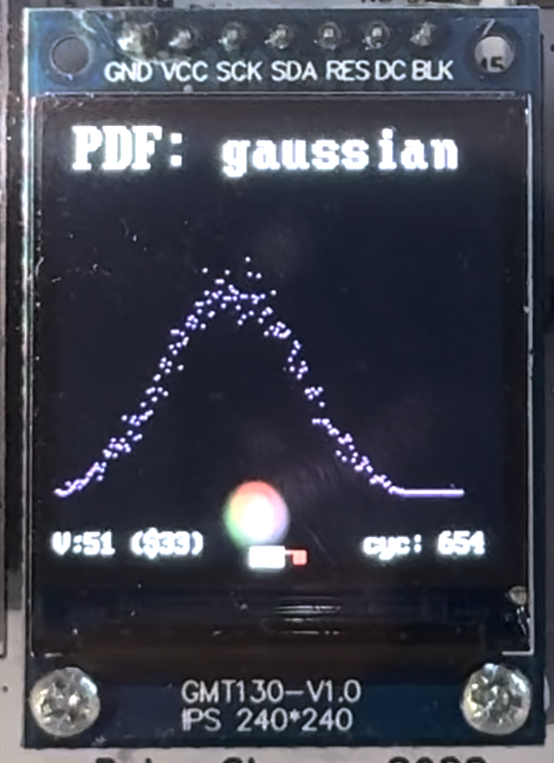
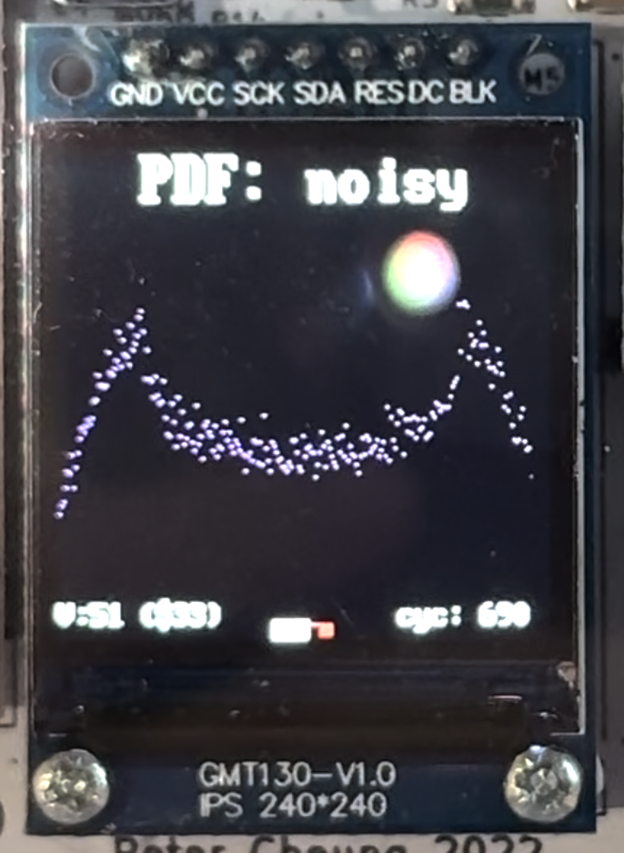
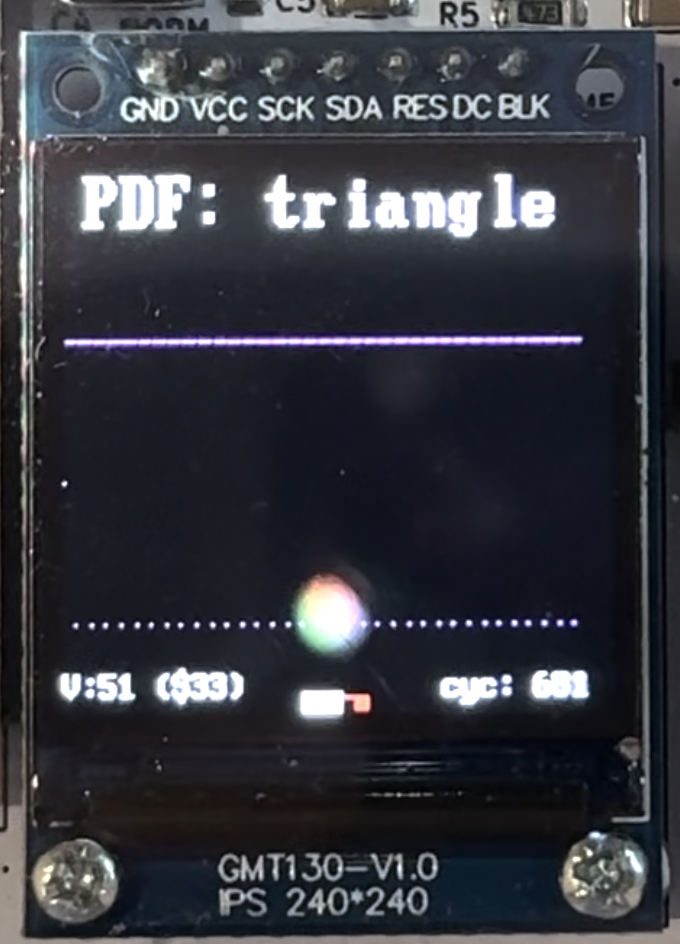
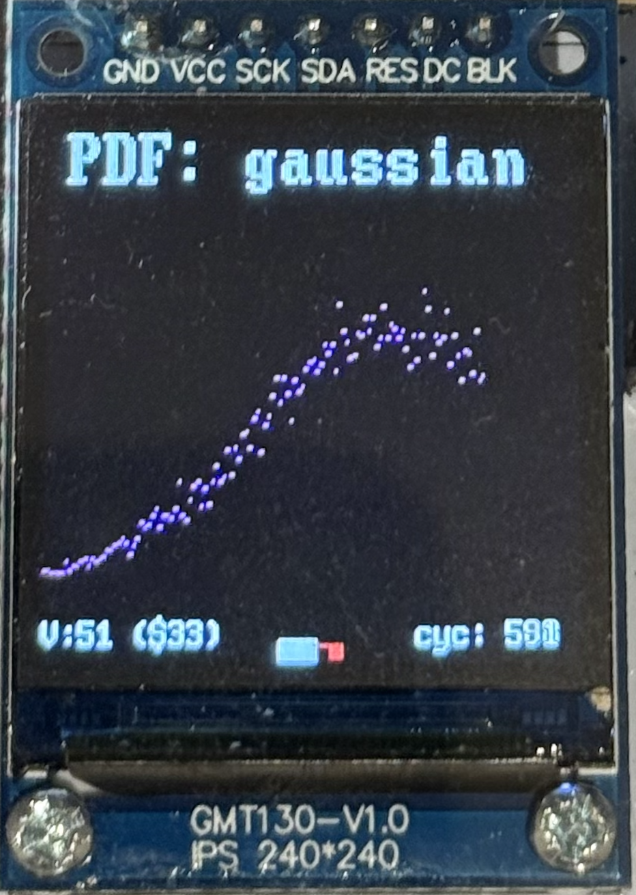

# Personal Contribution Statement - En Qi Lim

This document outlines my individual contribution to the RISC-V RV32I CPU project.

## Introduction

I am the verification engineer for Team 9, which consists of me, Jerry, Ezekiel, and Brandon. Our main task is to develop a RISC-V CPU using System Verilog, C++ and Verilator toolchain. In the end, we were able to design a single-cycle CPU, then extended it to a pipelined CPU with cache. 

I wrote test benches for our processor, tested various versions of CPU on Vbuddy, created the memory write back stage for pipeline CPU, and drew schematic diagrams of our CPU for our group statement.

## Single-Cycle

**Unit tests**

After everyone had created their hardware, I verified their correctness by developing targeted testbenches for each module to ensure their behaviour matched the specification. Several minor issues, such as signal mismatches and incorrect stage connections, were identified through early testing. Although individually small, these issues would have been difficult to diagnose once the full CPU was integrated. This confirmed that running unit tests at an early stage was the right decision, before the CPU design progressed further.

I also made some changes to `doit.sh` to create another script `unit.sh` to run unit tests, ensuring the paths to hardware were included correctly. 

**Vbuddy tests**

**F1 Test**

At this stage, the CPU is still relatively simple so we managed to pass the integration test quickly. I then proceeded to write test benches so that we can test our CPU on Vbuddy. For the F1 test, I used the testbench in Lab 3 to start off and made changes to accommodate the aim and nature of our processor. I also wrote the assembly code and bash script to run the testbench.

While writing the assembly code, I tried to include as many different instructions as I can. In the end, I managed to test 16 different instructions from running the F1 test.

The instructions tested were `addi` `sub` `add` `ori` `andi` `xori` `snez` `seqz` `blt` `bnez` `bne` `beqz` `j` `li` `slli` `srli`

```jsx
    vbdSetMode(0);
    
    top->clk = 0;
    top->rst = 0;
    top->trigger = 1;

    for (simcyc =0; simcyc<MAX_SIM_CYCLE; simcyc++){
        
        for (tick=0; tick<2; tick++){
            tfp->dump(2*simcyc + tick);
            top->clk = !top->clk; // toggle clock
            top->eval(); // evaluate model
        }

        top->trigger = !vbdFlag(); // to test trigger signal

        vbdBar(top->a0 & 0xFF); // the output is now a0
        vbdCycle(simcyc);

        if ((Verilated::gotFinish()) || (vbdGetkey()=='q'))
            exit(0);
    }
    
    vbdClose();
    tfp->close();
    exit(0);
```

Through the assembly code and testbench, I expected the Vbuddy light bar to light up one by one (each roughly 1 second apart), and when all of the lights are lit up, LFSR generates a random delay until the lights are all turned off again and then the sequence repeat. I also tested the trigger signal with Vbuddy’s rotary switch using `vbdFlag()` function.

Waveform is generated from the output of the testbench and this helps us to evaluate the behaviour of the CPU. Safe to say, our CPU is performing well at this stage. 

**PDF Test**

I then proceeded to write the testbench and script to run pdf test on Vbuddy. The assembly code was already provided in the initial repo so this stage was relatively faster than setting up the F1 test. At first, I plotted `a0` value every cycle and I realised it was stretching too much horizontally, so moving forward, I decided to plot `a0` value every three cycles to speed up the plotting process on Vbuddy. If we want to compress the graph more, just increase the number of cycles in the `if` condition.

```jsx
if (cycle % 3 == 0) {
	vbdPlot(top->a0, 0, 255);
	vbdCycle(cycle);
}
```

Other than that, one design worth mentioning is 

```jsx
bool plotting = false;
uint32_t last_a0 = top->a0;
int cycle = 0;

if (!plotting && top->a0 != last_a0) {
    plotting = true;
}
```

During reset and initialisation, the PDF memory is cleared and the processor executes the build stage. At this stage, the output register does not output any valid PDF data yet. To accommodate this, the testbench monitors changes on `a0` and will only begin to plot once the processor enters the display stage and meaningful PDF values are produced. 

I also tested the trigger signal with Vbuddy’s rotary switch using `vbdFlag()` function.

The testbench allows Vbuddy to plot 3 different probability distribution graph using the files provided (`gaussian.mem`, `noisy.mem`, `triangle.mem`)

<div style="display: flex; justify-content: center; gap: 20px;">
  
  
  
</div><BR>


`triangle.mem` contains discrete sample values whose frequency of occurrence produces a triangular-shaped probability distribution when accumulated into a histogram

Videos of the graph plotting on the screen can be found on our GitHub [`README.md`](https://github.com/brondum03/RISC-V-Team9#integration-test-results).

## Pipelined

For the pipelined CPU, I modified the `datamemory.sv` and `memory_top.sv`, then created `memory_pipeline_register.sv`

The `memory_top` module was updated to interface cleanly between the execute state and the memory stage, routing addresses, data, and control signals appropriately. The memory pipeline register was implemented to separate the memory and writeback stages, latching memory read data, ALU results, destination registers, and control signals on each clock edge. This ensures accurate timing alignment and allows multiple instructions to progress through the pipeline simultaneously. 

After everyone had done their parts on pipelining the CPU, I rewrote the testbenches to accommodate with the changes. However, this time, I only wrote testbench for each stage’s top module. As part of pipelining the CPU, signal names were updated to include stage-specific suffixes (F, D, E, M, W). Each testbench validates that data and control signals are correctly latched and propagated between pipeline stages on clock edges. The tests also verify pipeline control behaviour, including stalling, flushing, and data forwarding, ensuring correct temporal alignment across multiple instructions. 

Verifying the pipelined CPU required a change in how correctness was verified. Because of the multi cycle nature of pipelined CPU, certain test cases have to advance the simulation by more than one clock cycle to allow signals to propagate through intermediate pipeline registers before verification. I had to be extra careful controlling how many simulation cycles were run before checking outputs. 

**PDF Test**

By running the PDF test on Vbuddy, I observed that the distribution appears to be wider (stretched horizontally) compared to the ones running on single cycle processor although we are still plotting `a0` value every three cycles. This is because pipelined CPU completes instructions at a higher throughput, hence the output register `a0` updates more frequently. This behaviour confirms that multiple instructions are in flight simultaneously and we have successfully pipelined the CPU. 

<p align="center"></p>


**F1 Test**

I also ran F1 Test on our pipelined CPU and it behaves exactly as expected so now I am sure our pipelined CPU is functioning and ready to go. 

### Other Contributions

In addition to verification and testing, I was also responsible for writing and maintaining the [`README.md`](https://github.com/brondum03/RISC-V-Team9#readme), which documents the overall CPU architecture, GitHub branches, and demonstration steps. I also created the CPU block diagram for single cycle from scratch, as we were unable to find existing diagrams that accurately reflected our specific implementation. 

## Conclusion

Through this project, I gained a much deeper understanding of CPU design beyond individual modules, especially the importance of verification, timing and system-level behaviour. Working on this project highlighted how architectural decisions directly affect correctness, debugging complexity and test strategy.

One challenge that I faced was initially underestimating how much additional effort pipelining would introduce from the verification perspective. Compared to the single-cycle design, debugging issues in the pipelined CPU required more careful consideration about when signals should appear, rather than just what their values should be. 

In hindsight, I could have been more involved in the hardware data path implementation, particularly during earlier stages of the project. While my focus on verification and documentation was intentional and beneficial to the group as a whole, contributing more directly to the hardware design would have further strengthened my hardware design skills. I would also try to expand the test coverage to include more complex instruction sequences and improve automation around testing.

Overall, the project reinforced the importance of verification as a core part of hardware development rather than a secondary task. Working alongside my teammates was both enjoyable and rewarding. Being part of a motivated team made the development of our RISC-V processor engaging and productive. This project was a very valuable learning experience in both technical design and team-based development.
