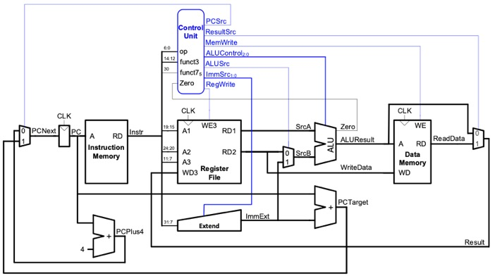
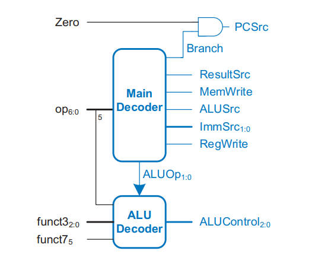
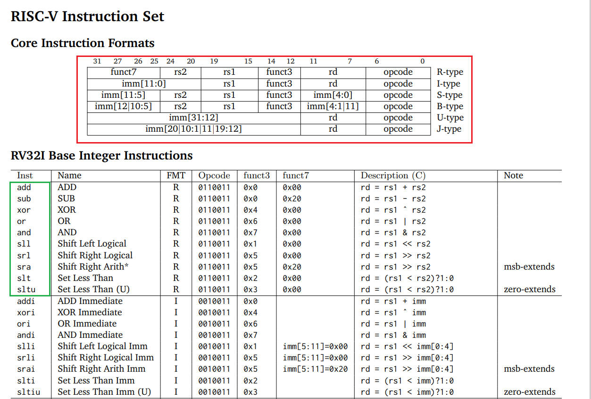
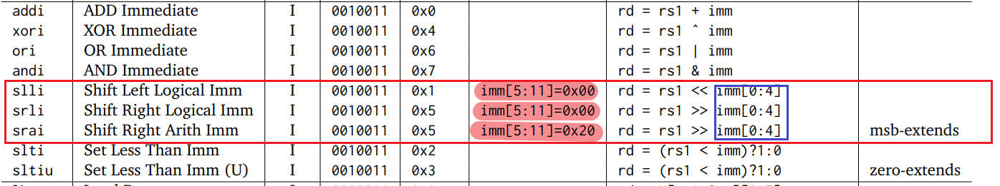

# Personal Contribution Statement — Ezekiel Lim

This document outlines my individual contributions to the RISC-V RV32I CPU project. It goes over the completed tasks, how and why design decisions were made, the strategies I used to overcome challenges and mistakes encountered while embarking on this project. At the end I have included the insights and lessons learnt from building the RISC-V CPU.

---

My work spans four major components:  

1. **Single-Cycle CPU Design & Integration**  
2. **Pipelined CPU – Decode Unit, ISA Completion, and Testing**  
3. **Cached Pipelined CPU – Functional Design and Debugging** 
4. **Extension of Single-Cycle CPU to Superscalar Processor that handles in process instructions** 

---

# 1. Single-Cycle CPU

My primary role in the single-cycle CPU was designing the decode logic, ensuring architectural correctness, and integrating my modules with Brandon, Jerry and Enqi's fetch, execute and memory submodules. I took a reference-driven approach by studying Harris & Harris as well as the official RV32I ISA reference card. This guided many early design decisions, signal definitions, and control-path structure.

---

## 1.1 Architectural Planning & Reference-Driven Design

Before coding, I read up on the single cycle CPU in Harris & Harris to understand the basics of how to implement a simple decode_top module and the considerations to take into account when doing so. 

As per the design in the book, I split the Control Unit up into an ALU Decoder and a Main Decoder. 
The following design is what I referenced initially to make design the decode module:

<p align="left">  </p><BR>

<p align="left">  </p><BR>

---

## 1.2 Decode Unit Implementation (`decode/` directory)

---

### Control Unit

I started with the control unit which i believed would have been the most time consuming and core aspect of the decode section. Initially, I split the control unit into `MainDecoder` and `ALUDecoder`. I used the following references when implementing and parsing the instruction bits.

<p align="left">  </p><BR>

#### ALU Decoder

Looking at the image above, I noticed that there were 10 instructions for R instructions. When comparing to the reference design, `ALUControl` only showed a 3 bit output (up to 8 combinations). This means that in order to account for all the instructions, the most straight forward approach was to increase ALUControl output to 4 bits (up to 16 combinations) and map that to each instruction. 

The following table is which operation each `ALUControl` maps to:

| ALUControl (binary) | Operation |
|---------------------|-----------|
| `0000`              | ADD       |
| `0001`              | SUB       |
| `0010`              | AND       |
| `0011`              | OR        |
| `0100`              | XOR       |
| `0101`              | SLL       |
| `0110`              | SRA       |
| `0111`              | SRL       |
| `1000`              | SLT       |
| `1001`              | SLTU      |


#### Main Decoder

When working on the `MainDecoder`, the initial step was to take a look at the core instruction formats and note how many instructions have to handle immediate extension as this would determine how I decide to implement the `signExtend` module. Looking at core instructions, I noted that there were a total of 6 instructions, R, I, S, B, U and J. However, R instructions do not require sign extension as they do not use immediates. As such, there are 5 instructions where immediate would have to be sign extended. When looking at the initial design, `ImmSrc` was 2 bits (maximum 4 types of instructions). As such, I increased `ImmSrc` to 3 bits so as to account for every type of instruction.

The following is how i mapped `ImmSrc` to the instruction type :

| ImmSrc (binary) | Instruction Type |
|-----------------|------------------|
| `000`           | **I-type**       |
| `001`           | **S-type**       | 
| `010`           | **B-type**       |
| `011`           | **U-type**       |
| `100`           | **J-type**       | 

As I was trying to start on working on the full instruction set from the get go, I started to consider `branch` and `jump` instructions affecting the `PC` as well. Initially `PCSrc` was 1 bit as it was simply to move to the next instruction `PC + 4` or the branched instruction `PCTarget`. I decided that to take into account stalling and jump instructions as well, we would require 2 bits for our `PCSrc` (maximum 4 types for `PCNext`).

The following is how I mapped `PCSrc` to what kind of `PCNext` to take :

| PCSrc (binary) | Meaning / Selected Next PC |
|----------------|----------------------------|
| `00`           | **PC + 4** (normal sequential execution) |
| `01`           | **PCTarget** (branch taken or JAL) |
| `10`           | **ALUResult** (JALR target) |
| `11`           | **PC** (stall — hold current PC) |

```verilog 

mux4 pcmux(
    .in0(PCPlus4),
    .in1(PCTarget),
    .in2(ALUResult),
    .in3(PC),
    .sel(PCsrc),
    .out(PCNext)
);

```

The final increase in bit width I had to do was on `ResultSrc` (compared to the Harris & Harris diagram). The initial `ResultSrc` was only 1 bit to choose between `ALUResult` and `ReadData`. However, to account for all the instructions we would have to add an additional bit. 
Initially, 
`ResultSrc = 0`, `ALUResult` is written back to register file (for R, I instructions and address calculations)
`ResultSrc = 1`, `ReadData` is written back to register file (for load instructions)

The issue now is that jump instructions cannot be implemented as such we increase to a 2 bit selector. 00 and 01 remain the same. 
`ResultSrc = 10`, `PC+4` is stored (for jump instructions, to store return address before jumping to the target)
`ResultSrc = 11`, `ImmExt` is stored (upper immediate storing due to the limitations of riscv with adding immediates more than 3 bytes)

The following is how I mapped `ResultSrc` to select `Result` in `memory_top`

| ResultSrc (binary) | Written Back Value | Instructions Affected |
|--------------------|--------------------|------------------------|
| `00`               | **ALUResult**      | R-type ops, I-type ALU ops, address calculations |
| `01`               | **ReadData**       | Load instructions (LB, LH, LW, LBU, LHU) |
| `10`               | **PC + 4**         | JAL, JALR (store return address before jumping) |
| `11`               | **ImmExt**         | U-type: LUI, AUIPC (handling upper-immediate values) |

On top of increasing the output bit width of `PCSrc`, `ResultSrc` and `ImmSrc`, In my main decoder I also introduced `AddressingMode` output (1 bit) which selected between 

| AddressingMode | Type |
|----------------|------|
|`0`             | Word |
|`1`             | Byte |


This was done in order to correctly parse the bits for the 5 tests given. 
The following is the snippet of code where `AddressingMode` was used in Load and Store instructions :

```verilog 

// I -> load operations --> lw, lb, lbu
7'b0000011: begin
    RegWrite = 1;
    ALUSrc = 1;
    ResultSrc = 1;
    ImmSrc = 3'b000;
    MemWrite = 1'b0;
    PCSrc = 2'b00;
    case(funct3)
        3'b010: AddressingMode = 1'b0;  // lw
        3'b100: AddressingMode = 1'b1;  // lbu
        default: AddressingMode = 1'b0;
    endcase
end
// S -> store operations --> sw, sb
7'b0100011: begin
    MemWrite = 1;
    ALUSrc = 1;
    ImmSrc = 3'b001;
    RegWrite = 1'b0;
    PCSrc = 2'b00;
    case(funct3) 
        3'b000: AddressingMode = 1'b1;  // sb
        3'b010: AddressingMode = 1'b0;  // sw
        default: AddressingMode = 1'b0;
    endcase
end

```

An additional input, `negative` was also added. This was done to implemented conditional branches which is showed in this snippet of code from `MainDecoder` :

```verilog
// B -> conditional branch operations -->> beq, bne, blt, bge
7'b1100011: begin
    RegWrite = 1'b0;
    ALUSrc = 1'b0;
    ImmSrc = 3'b010;
    MemWrite = 1'b0;
    case (funct3)
        3'b000: PCSrc = Zero ? 2'b01 : 2'b0;       // beq
        3'b001: PCSrc = ~Zero ? 2'b01 : 2'b0;      // bne
        3'b100: PCSrc = negative ? 2'b01 : 2'b0;   // blt 
        3'b101: PCSrc = ~negative ? 2'b01 : 2'b0;  // bge
        3'b110: PCSrc = negative ? 2'b01 : 2'b0;   // bltu
        3'b111: PCSrc = ~negative ? 2'b01 : 2'b0;  // bgeu
        default: PCSrc = 2'b0; // Default case
    endcase
end
```
#### Putting it together

With both `ALUDecoder` and `MainDecoder` complete, I simply put it together in `ControlUnit`.

```verilog  

module controlUnit (
    input logic [6:0]   op,
    input logic         Zero,
    input logic         stall,
    input logic         negative,
    input logic [2:0]   funct3,
    input logic         funct7,

    output logic [1:0]  PCSrc, // 0->move to next, 1->branch, 2->jump, 3->stall
    output logic [1:0]  ResultSrc,
    output logic        MemWrite,
    output logic        ALUSrc,
    output logic [2:0]  ImmSrc,
    output logic        RegWrite,
    output logic        AddressingMode, // --> 0 for word, 1 for byte
    output logic [3:0]  ALUControl
);

    // main decoder
    mainDecoder mainDec(
        .op        (op),
        .Zero      (Zero),
        .stall     (stall),
        .negative  (negative),
        .funct3    (funct3),

        .PCSrc     (PCSrc),
        .ResultSrc (ResultSrc),
        .MemWrite  (MemWrite),
        .ALUSrc    (ALUSrc),
        .ImmSrc    (ImmSrc),
        .RegWrite  (RegWrite),
        .AddressingMode (AddressingMode)
    );

    // alu decoder
    aluDecoder aluDec (
        .op         (op),
        .funct3     (funct3),
        .funct7     (funct7),

        .ALUControl (ALUControl)
    );
    
endmodule

```

### Sign Extend

`SignExtend` was rather straightforward to implement. In this single cycle version, while we did aim to start implementing the full instruction set, we did not complete it. The following `SignExtend` contains an issue with shift immediate instructions 
(`slli`, `srli`, `srai`). I only noticed this after doing rigorous testing for every instruction in the pipelining stage.

The following is the straightforward sign extension we followed which follows the RISC-V Reference : 

``` verilog

always_comb begin
        case (ImmSrc)
            3'b000:    ImmExt = {{20{Instr[31]}}, Instr[31:20]}; // I-type
            3'b001:    ImmExt = {{20{Instr[31]}}, Instr[31:25], Instr[11:7]}; // S-type
            3'b010:    ImmExt = {{20{Instr[31]}}, Instr[7], Instr[30:25], Instr[11:8], 1'b0}; // B-type
            3'b011:    ImmExt = {Instr[31:12], 12'b0}; // U-type
            3'b100:    ImmExt = {{11{Instr[31]}}, Instr[31], Instr[19:12], Instr[20], Instr[30:21], 1'b0}; // J-type
            default:   ImmExt = {{20{Instr[31]}}, Instr[31:20]};
        endcase
end

```

### Register

The `Register` was worked on by Brandon in the Lab4 task which we reused for the single cycle CPU. 

### Putting the Decode Unit Together

Putting the `DecodeUnit` together was quite straightforward as I had split up the modules up properly which made integration easier. 

The following is the overview of the `DecodeUnit` :

``` verilog

module decode_top #(
    parameter DATA_WIDTH = 32
)(
    input logic                     Zero,
    input logic                     stall,
    input logic                     negative,
    input logic                     clk,
    input logic [DATA_WIDTH-1:0]    WD3, 
    input logic [DATA_WIDTH-1:0]    Instr,
    input logic                     rst,

    output logic [1:0]              PCSrc,
    output logic [1:0]              ResultSrc,
    output logic                    MemWrite,
    output logic [3:0]              ALUControl,
    output logic                    ALUSrc,
    output logic                    AddressingMode,
    output logic [DATA_WIDTH-1:0]   RD1, 
    output logic [DATA_WIDTH-1:0]   RD2,
    output logic [DATA_WIDTH-1:0]   ImmExt,
    output logic [DATA_WIDTH-1:0]   a0
);

    // internal wire connections
    logic [2:0]                     ImmSrc;
    logic                           RegWrite;

```
---

## 1.3 Integration Work

I collaborated with Brandon and Jerry to integrate my decode logic with:

- Program counter logic  
- Instruction memory  
- The ALU and register file  
- The writeback multiplexer  

This standardised our signal naming conventions and ensured the CPU was structured for a smooth transition into pipelining.

---

## 1.4 Reflection (Single Cycle)

The single-cycle CPU gave me a strong foundation in understanding instruction decoding, datapath signal flow, and the architectural guarantees required by RV32I. Designing decode from scratch forced me to thoroughly understand instruction formats and their interactions. On hindsight, I was not flexible enough and was initially doubtful about changing the bit width as I did not want to veer away from what was in the book. I learnt to be less rigid when working and to be unafraid to try new changes.

---

# 2. Pipelined CPU

My largest contribution to the overall project was implementing the **decode stage for the pipelined CPU** and ensuring that the **full RV32I ISA** worked correctly under pipelining hazards, forwarding, and flushing.

I also wrote 10 assembly tests (tests 6–15) covering all instruction types.

---

## 2.1 Pipelined Decode Module (`decode/` folder)

I extended my single-cycle decoder into a decode stage that supports:

- Decode pipeline register (D → E)
- Flush and stall logic integration  
- Immediate generation per pipeline stage  
- Branch/jump control propagation  
- Register file reads under forwarding constraints  

Similar to the single cycle processor, for the pipelined implementation, I referenced the Harris & Harris book. For the pipelined decode folder, there were no changes to `Register`.

### Control Unit
For the `ControlUnit`, I decided to collapse it into one module instead as it got very confusing and handle the parsing and input and output all in the same module. The key consideration for the `ControlUnit` in this design was to in a way decouple the `Controlunit` from the next stage Execute. When we analyse the initial single cycle CPU, we notice that the `Zero` and `Negative` signals are being fed back in from the next stage which is fine when it is done in a single cycle. However, for the pipelined version, we cannot use these 'future' signals. Instead, we have to use a `BranchD` and `JumpD` output which indicates the type of operation from `ControlUnit` to the next stage. 

The following are the `BranchD` and `JumpD` mappings to the instruction :

| BranchD (binary) | Meaning        |
|------------------|----------------|
| `000`            | No branch      |
| `001`            | BEQ            |
| `010`            | BNE            |
| `011`            | BLT            |
| `100`            | BGE            |
| `101`            | BLTU           |
| `110`            | BGEU           |

| JumpD (binary) | Meaning   |
|----------------|-----------|
| `00`           | No jump   |
| `01`           | JAL       |
| `02`           | JALR      |
| `11`           | Stall     |

Additionally, we expanded the `AddressingMode` output signal to handle the full store and load instruction set

| AddressingMode (binary) | Meaning         |
|--------------------------|-----------------|
| `000`                    | Byte            |
| `001`                    | Half            |
| `010`                    | Word            |
| `011`                    | Byte (unsigned) |
| `100`                    | Half (unsigned) |

### Decode Pipeline
For the `DecodePipeline` module, I had to work closely with Brandon who was implementing the `HazardUnit` in the Execute stage to ensure proper forwarding, flushing and stalling. 
`DecodePipeline` acts as a bridge between the Decode and Execute stage. The following logic is implemented

``` verilog    

always_ff @ (posedge clk) begin 
    if(!FlushE && !rst && !trigger) begin 
        RegWriteE       <= RegWriteD;
        ResultSrcE      <= ResultSrcD;
        MemWriteE       <= MemWriteD;
        JumpE           <= JumpD;
        BranchE         <= BranchD;
        ALUControlE     <= ALUControlD;
        ALUSrcE         <= ALUSrcD;
        AddressingModeE <= AddressingModeD;
        RD1E       <= RD1D;
        RD2E       <= RD2D;
        PCE        <= PCD;
        Rs1E       <= Rs1D;
        Rs2E       <= Rs2D;
        RdE        <= RdD;
        PCPlus4E   <= PCPlus4D;
        ImmExtE    <= ImmExtD;
    end
    else if(FlushE || rst) begin 
        // // Flush pipeline — set everything to 0
        RegWriteE       <= 1'b0;
        ResultSrcE      <= 2'b00;
        MemWriteE       <= 1'b0;
        JumpE           <= 2'b00;
        BranchE         <= 3'b000;
        ALUControlE     <= 4'b0000;
        ALUSrcE         <= 1'b0;
        AddressingModeE <= 3'b000;
        RD1E       <= '0;
        RD2E       <= '0;
        PCE        <= '0;
        Rs1E       <= '0;
        Rs2E       <= '0;
        RdE        <= '0;
        PCPlus4E   <= '0;
        ImmExtE    <= '0;
    end
end

```


---

## 2.2 Ensuring Full ISA Coverage

A major responsibility of mine was verifying that **every instruction in the full RV32I base architecture** was implemented correctly in the pipelined design. This included:

- All ALU ops (ADD/SUB, SLT, SLTU, XOR, OR, AND, SLL, SRL, SRA)  
- All immediate ops  
- All branch conditions (signed/unsigned)  
- LUI/AUIPC  
- JAL/JALR  
- All loads/stores  

---

## 2.3 Assembly Tests (Tests 6–15)

To validate the CPU, I authored tests 6–15 entirely in assembly, each designed to capture one category of instruction:

- Shift operations  
- Load/store with different addressing modes  
- AUIPC / LUI  
- Jump correctness  
- Sign-extension behaviour  
- Pipeline-hazard situations  

| Test File            | Description |
|----------------------|-------------|
| **6_all_logicals.s** | Tests all logical operations (AND, OR, XOR, SLL, SRL, SRA). |
| **7_all_imms.s**     | Tests immediate-based arithmetic and logical instructions. |
| **8_load_byte.s**    | Tests LB (load byte, sign-extended). |
| **9_load_half.s**    | Tests LH (load halfword, sign-extended). |
| **10_load_word.s**   | Tests LW (load 32-bit word). |
| **11_load_byte_u.s** | Tests LBU (load byte unsigned). |
| **12_store_byte.s**  | Tests SB (store byte). |
| **13_store_half.s**  | Tests SH (store halfword). |
| **14_srai.s**        | Tests SRAI (arithmetic right shift immediate). |
| **15_sltiu.s**       | Tests SLTIU (set-less-than-immediate unsigned). |
*

Writing these tests is where I discovered the **SRAI bug**, which I then fixed.

This was the test for `srai` :

```
.text
.globl main
main:

    # --------------------------
    # SRAI   (-64 >> 2 = -16)
    # --------------------------
    li t1, -64
    srai a0, t1, 2          # arithmetic right shift
    li t3, -16
    bne a0, t3, finish

finish:
    # Final expected result = -16
    bne a0, a0, finish      # infinite loop
 ```

The issue that I faced was that the `signExtend` was extending all 12 bits when it encountered an immediate logical/arithmetic operation. Which I had not noticed earlier when implementing the instructions in the single cycle processor. This is seen in the following row :

<p align="left">  </p><BR>
 
Inorder to fix that, I had to add 2 changes into my decode folder. 

Firstly, I now had to send a signal to `SignExtend` to indicate if a certain instruction is of the immediate type and require shifting. I therefore added a signal called `shiftImmFlag` which is then passed into `signExtend`

| ShiftImmFlag           | Description |
|----------------------|-------------|
| 0 | Does not need special sign extension |
| 1 | Requires special sign extension |

Secondly, I had to change the way I handled `SignExtend` the code is as follows :

``` verilog
always_comb begin
    if (shiftImmFlag && (ImmSrcD == 3'b000)) begin 
        ImmExtD = {{27{InstrD[24]}}, InstrD[24:20]};
    end
    else begin
        case (ImmSrcD)
            3'b000:    ImmExtD = {{20{InstrD[31]}}, InstrD[31:20]}; // I-type
            3'b001:    ImmExtD = {{20{InstrD[31]}}, InstrD[31:25], InstrD[11:7]}; // S-type
            3'b010:    ImmExtD = {{20{InstrD[31]}}, InstrD[7], InstrD[30:25], InstrD[11:8], 1'b0}; // B-type
            3'b011:    ImmExtD = {InstrD[31:12], 12'b0}; // U-type
            3'b100:    ImmExtD = {{11{InstrD[31]}}, InstrD[31], InstrD[19:12], InstrD[20], InstrD[30:21], 1'b0}; // J-type
            default:   ImmExtD = {32'b0};
        endcase
    end
end

``` 

---

## 2.4 Collaboration & Integration

I worked very closely with Jerry and Brandon during pipelining.  
While Jerry handled pipeline control (branching, PCSrc, flushing) and Brandon implemented execution/memory elements, I ensured that:

- Decode signals were correct  
- No instruction class was missing  
- ALUControl always matched the ISA  
- Hazard unit received correct metadata from decode  

This division of work made debugging structured and efficient.

---

# 3. Cached Pipelined CPU

My third contribution was working on the **design of the cache**. For this stage, Brandon did the implementation of the cache. My contribution to this portion was designing the cache with the rest of the team and helping to analyse the GTKWave and give my analysis on what I thought could have gone wrong.

---

## 3.1 Cache Design

We decided on implementing a cache that had temporal and spatial locality. The `CacheController` is split into 4 main states. Namely the `Idle`, `Compare Tag`, `Allocate` and `Write-Back` state.

In the `Idle` state, the cache waits for the CPU to send valid memory access. When that is done, it moves onto the next state, `Compare Tag`.
In `Compare Tag`, the cache checks if the requested address is already in the cache by checking valid bits and if the tag matches.
If it is a hit, then the data is either read from/written to. Reading is straightforward. However, we note that in order to keep the cache fast, when it is written to, the cache updates its local version and sets the dirty bit as an indicator that it is not a different version from the one in the DRAM. This is important so that if the data is evicted, we are able to note whether or not we have to update the data in our DRAM. After a hit, the next state would be back to `Idle`. If there is a miss, a victim way is chosen. If that set is filled, the cache will evict an entry based on the LRU (least recently used) policy. If the victim block is clean, the next state is `Allocate`. However, if it is dirty, we go to `Writeback` as we have to write the newest data to memory. 


---

# 4. In Process Superscalar Single Cycle CPU

For this portion, I did not have much time to implement a proper superscalar CPU. However, reading the Harris & Harris book got me interested into looking more into doing multiple calculations and instructions at once. As such, I decided to implement an simple superscalar CPU that only handles R/I arithmetic and logical operations.

## 4.1 Implementation

For the implementation, it was a case of doubling the fetching of instructions, decoding and executing them. I doubled the bit width for most of my output signals as shown in this code :

``` verilog

module controlUnit (
    input logic         stall,

    input logic [6:0]   op1,
    input logic [2:0]   funct3_1,
    input logic         funct7_1,

    input logic [6:0]   op2,
    input logic [2:0]   funct3_2,
    input logic         funct7_2,

    output logic        PCSrc, 
    output logic [1:0]  ResultSrc,
    output logic [1:0]  MemWrite, // 0 -> none write // 1 -> WE1 // 2 -> WE2 // 3 -> WE1 and WE2
    output logic [1:0]  ALUSrc, // 00, 01, 10, 11 --> split bit for srcMux selectors
    output logic [5:0]  ImmSrc, // 3 bits each [2:0] for Instr1 [5:3] for Instr2
    output logic [1:0]  RegWrite, // 0 -> none write // 1 -> WE3 // 2 -> WE6 // 3 -> WE3 and WE6
    output logic [7:0]  ALUControl, // 4 bits each --> [3:0] for Instr1 [7:4] for Instr2
    output logic [1:0]  shiftImmFlag // 2 bits parse it and check if need to extend immediate for shift instruction
);  

```

I chose the LSBs to be used for `Instr1` and the MSBs to be used for `Instr2`.

## Testing

The testing for this code can be seen in the team statement under the portion on superscalar.

---

# 5. Personal Reflection & Takeaways

Working on the RV32I CPU project significantly deepened my understanding of digital design, hardware architecture, and practical SystemVerilog implementation. One of the most important lessons I gained was learning to think beyond rigid textbook diagrams. As the project grew more complex, especially in the transition from a single-cycle to a pipelined processor, I had to make real design decisions rather than rely solely on predefined structures. Designing the decode logic in particular taught me how to evaluate instruction formats, choose appropriate control signals, and decide when additional bit-widths or multiplexing options were necessary. Each extension required balancing correctness, hardware cost, and pipeline compatibility. I also became more comfortable reading the ISA specification and translating it into hardware-level behavior. Writing my own assembly test programs forced me to understand every corner of the instruction set, from load/store edge cases to branch and jump sequencing. Through debugging, waveform inspection, and resolving mismatches between expected and actual behavior, I learned how hardware bugs differ from software bugs, and how subtle signal interactions can break a pipeline.Overall, this project made me more technically flexible. I learned how to design, explore alternatives, question assumptions, and ultimately create hardware that is both functional and extensible.

Beyond the technical aspects, this project strengthened how I work with others. Implementing a CPU is not something one person can do efficiently in isolation, so teamwork became essential. I learned how to divide modules logically, synchronise our design decisions, and integrate separate components without conflicts. Communication was also a major theme. Whether explaining hazards, decode logic, or pipeline flow to teammates, I became more confident expressing technical reasoning clearly. Regular discussions, debugging sessions, and design reviews taught me how to both give and receive constructive feedback. These interactions helped ensure our final design was coherent, consistent, and robust.

---