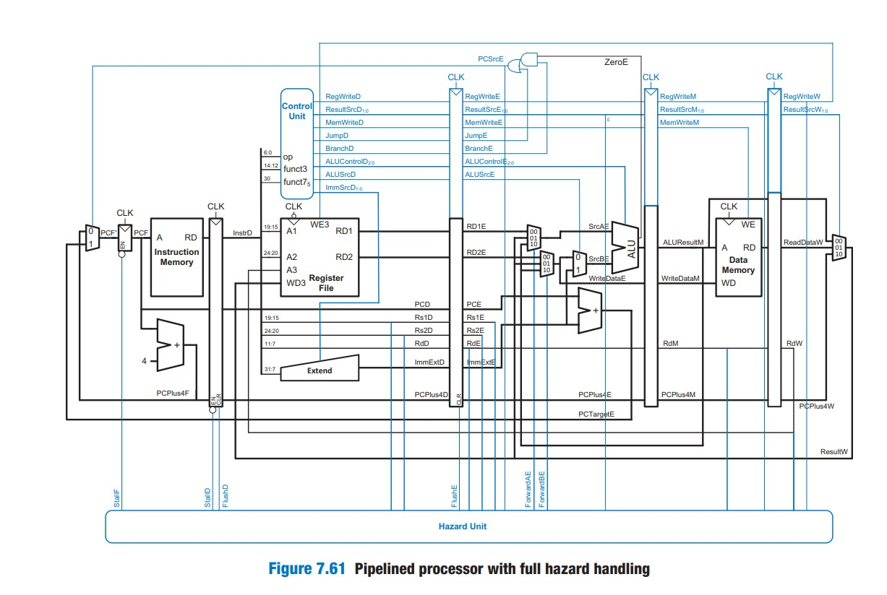

# Personal Contribution Statement — Jerry Zhang

This document outlines my individual contributions to the RISC-V CPU project, structured according to the main tasks I worked on in: **Single-Cycle CPU**, **Pipelining**, and **Cache Development**.  
Each section includes what I implemented, problems encountered, mistakes made, reflections and a selection of major commits.

---

## 1. Single-Cycle CPU

For the single cycle CPU, I created the instruction memory and the program counter module, corresponding to the fetch stage in a pipelined CPU. 

### Instruction Memory (`instruction_memory.sv`)
- The instruction memory is the module instruction fetch to be fed into the decoder to generate signals and flags.
- Since RISC-V stores 1 byte in each address, but each instruction is 32 bits, so each instruction uses 4 bytes in storage. 
- Hence, Program Counter is incremented by 4 since each instruction takes 4 address locations.
- The instruction memory takes in a PC value and outputs the instruction stored in the program at that PC value. 
```verilog
logic [DATA_WIDTH-1:0] mem [MEM_SIZE-1:0];
always_comb begin
    out  = {mem[in+3], mem[in+2], mem[in+1], mem[in+0]}; // 32-bit word from 4 bytes
end
```

### Program Counter (`program_counter.sv`)

- The program counter in the single cycle cpu controls the PC update logic.
- Inside the counter, the output updates to the next PC Target determined by other components.  
- Reset behaviour is also implemented and the Program counter updates on positive edge of the clock.
- The program counter simply takes in the pre determined next PC value and updates the register at each clock cycle. 

```verilog 
always_ff @(posedge clk) begin
        if (rst) begin
            pc <= {DATA_WIDTH{1'b0}};
        end else begin
            pc <= PCNext;
        end
    end    
```

### Integration into the CPU (`fetch/fetch_top.sv`)
- The fetch_top sv is the top level module including the instruction memory and program counter. It creates a convenient interface to have fetch stage components interact with the rest of the CPU. 
- The pcmux decides between the 4 potential next PC value to fed into the program counter to store and instruction memory to fetch the instruction,. 
- The 4 choices for the next PC value at  
    1. PC+4 (normal program progression)
    2. ALUResult (for JALR instructions) 
    3. PCTarget (for branch instructions)
    4. the current PC (during a stall)
- The mux selection signal is PCSrc generated by the decode unit.

### Challenges / Issues Encountered
- Initially I had all the PC value determination logic inside the program counter module, but decided to move it outside the program counter module into the layer above. This allowed my teammates to better understand my code, and it proved a lot easier to add onto when we moved onto the pipelining stage. 

### 1.4 Reflection (Single-Cycle)
- If starting again, I would have finished this section at lot sooner so we could have more time to work on the pipelined cpu and the cache since this was rather easy since I implemented the program counter in lab4 reduced RISC-V cpu. 
- Debugging the pipelined CPU and Cache proved a lot more challenging than we expected.

### 1.5 Important Commits
1. Created Instruction Memory 
https://github.com/brondum03/RISC-V-Team9/commit/9c1dbd424e858ecd8181a45fba7fd543357e2702

2. Top level SV file creation for fetching
https://github.com/brondum03/RISC-V-Team9/commit/ef388cfe30ed3d941659f1d89853d7b9dec35fd6

3. Successful testing of all my modules 
https://github.com/brondum03/RISC-V-Team9/commit/7dd1de446e6d8640e6eac29b0fa55f012d33d2ca
---

## 2. Pipelining

- After the single cycle cpu pipeline stage, our group moved onto pipelining register. 
- Here, I was in charge of the implementation of pipelining in the memory/writeback stage and the fetch stage. 
- I also created a custom branch and jump logic that decides to program counter where to source the next PC from. 
- Lastly, I was in charge of debugging and verifying the entire pipelined cpu. 

<p align="left">  </p><BR>

### Fetch Stage Integration
- For pipelining, the fetch stage need to add the Fetch-Decode pipelining register. 
- We also had to change the nextPC logic from the single cycle CPU, since 
    1. the sign extend module is now in the decode pipelining stage
    2. Branch logic is decided in the execute stage. 
- Due to the cpu now taking multiple sub cycles for 1 instruction, each nextPC has to make its way all the way through all stages before reaching the Fetchstage again to keep timing accuracy. Hence PCF is now in a 2mux decided by branch and jump logic.  

#### Fetch pipeline register(`fetch/fetch_pipeline.sv`)
- To clarify, any signal that is in the fetch stage before the fetch/execute pipeline register ends in F, such as InstrF, PCPlus4F, signals that come out of the register goes into the decode stage, therefore they end in D.  
- The signals that need to be pipelined are InstrD, PCD and PCPlus4D.
- For pipelining, our group not only decided to implement forwarding, we also implemented stalling and flushing. 
- The pipeline register flushes its values, sets them to 0 when FlushD or rst(reset signal) becomes high. 
- The pipeline register HOLDS or freezes its value during Stall
- If no signals are imposed, the pipeline register simply passes on the current Instr, PC and PCPlus4 onto the next stage. 

#### PC determining logic (`execute/pcsrc_logic.sv`)
- Since our group also decided to incorporate stretch goal 3, implementing the remaining RV32I base instructions, the next PC value is also decided by JAL and JALR, BLTU and BGEU instructions, which we didn't implement fully in the single cycle. 
- here the inputs are taken from the ALU flags. 
- Due to the need of implementing BLTU Branch Less than unsigned, I had to create a new flag in the control unit called Less_unsigned in the ALU. 

```verilog 
    assign Less_unsigned = $unsigned(ALUop1) < $unsigned(ALUop2);
```

```verilog 
 always_comb begin   // check for jump instructions 
        case (JumpE)
            2'b01: PCSrcE = 1'b1;   // JAL 
            2'b10: PCSrcE = 1'b1;   // JALR
        default: begin  // then check for branch conditions
            case (BranchE)
                3'b001: PCSrcE = ZeroE;             // BEQ
                3'b010: PCSrcE = ~ZeroE;            // BNE
                3'b011: PCSrcE = NegativeE;         // BLT
                3'b100: PCSrcE = ~NegativeE;        // BGE
                3'b101: PCSrcE = Less_unsignedE;    // BLTU 
                3'b110: PCSrcE = ~Less_unsignedE;   // BGEU 
                default: PCSrcE = 1'b0;
            endcase
        end 
        endcase
    end 
```

### Memory Stage Integration
- For the memory stage, there are 2 main changes made. 
- The datamemory module is altered to support addressing modes for instructions such as load half and store half. 
- The pipeline register needs pipeline the memory signals coming from the execute register to the writeback stage.
- Integrated MEM stage with datamemory.
- Ensured correct propagation of MemRead/MemWrite and ALU results into MEM/WB.

#### Updated data memory module (`memory/datamemory.sv`)
- both read and write are changed to support LB, LH, LW, LBU, LHU and SB, SH and SW.

```verilog
always_comb begin
        logic [31:0] word;
        word = { memory[address+3], memory[address+2], memory[address+1], memory[address] };
        case (addr_mode)
            3'b000: read_data = {{24{memory[address][7]}}, memory[address]};                      // LB
            3'b001: read_data = {{16{memory[address+1][7]}}, memory[address+1], memory[address]}; // LH
            3'b010: read_data = word;                                                             // LW
            3'b011: read_data = {24'b0, memory[address]};                                         // LBU
            3'b100: read_data = {16'b0, memory[address+1], memory[address]};                      // LHU
            default: read_data = word;
        endcase
    end

    always_ff @(posedge clk) begin
        if (write_enable) begin
            case (addr_mode)
                3'b000,3'b011: begin                                                              // SB 
                    memory[address] <= write_data[7:0];
                end
                3'b001,3'b100: begin                                                              // SH 
                    memory[address] <= write_data[7:0];
                    memory[address+1] <= write_data[15:8];
                end
                3'b010: begin                                                                     // SW 
                    memory[address] <= write_data[7:0];
                    memory[address+1] <= write_data[15:8];
                    memory[address+2] <= write_data[23:16];
                    memory[address+3] <= write_data[31:24];
                end
                default: ;
            endcase
        end
    end

```

## Debugging the Pipelined CPU 

### Problem
- After completing the RTL implementation for the pipelined CPU, the group ran five tests: **AddiBne**, **LiAdd**, **LbuSb**, **JalRet**, and **Pdf**.
- The CPU was only able to pass **LiAdd** and failed the other four tests.
- After being stuck for two days without clear progress, I decided to debug the issue by systematically tracing **GTKWave waveforms** for each failing test case.

---

### Process
- I started with the **AddiBne** test, and moved on to the **JalRet** test and traced pipeline signals cycle-by-cycle. After a night of debugging through viewing waveforms and inspecting the rtl, I found the following problems in the design and implemented the fixes accordingly. 

---

### Fixes
#### 1. Incorrect Decode-Stage Flushing for Branches
- **BranchD was not being flushed properly** during taken branch instructions.
- Root cause:
  - `FlushD` was not passed into `decode_top`, so decode-stage control signals (`BranchD`, `JumpD`, etc.) were never cleared.
  - When the decode pipeline register updated, stale `BranchD` values propagated forward, causing **`BranchE` to assert spuriously**.
- Changes made:
  - Redefined `FlushD` in the hazard unit from  
    `FlushD = lwstall`  to  `FlushD = PCSrcE`, so flushing occurs on taken branches, this allows the correct instructions after a branch to be pipelined.
  - Implemented explicit flushing logic inside `decode_top`.
    ```verilog
        always_comb begin
            if (FlushD) begin
                RegWriteD       = 0;
                ResultSrcD      = 0;
                MemWriteD       = 0;
                JumpD           = 0;
                BranchD         = 0;
                ALUControlD     = 4'b0000;
                ALUSrcD         = 0;
                AddressingModeD = 0;
            end else begin
                RegWriteD       = RegWriteD_out;
                ResultSrcD      = ResultSrcD_out;
                MemWriteD       = MemWriteD_out;
                JumpD           = JumpD_out;
                BranchD         = BranchD_out;
                ALUControlD     = ALUControlD_out;
                ALUSrcD         = ALUSrcD_out;
                AddressingModeD = AddressingModeD_out;
            end
        end
    ```
  - I Created intermediate decode control signals so that the final outputs could be forced to zero on a flush (required to satisfy Verilator constraints).
- Result:
  - After this fix, the CPU successfully passed **AddiBne**, **LiAdd**, and **LbuSb**.


---

#### 2. Missing JALR-Specific PC Target Logic
- **JALR was incorrectly handled the same way as JAL**, which is architecturally wrong.
  - JAL: `PC = PC + imm`
  - JALR: `PC = rs1 + imm`
- Changes made:
  - Replaced the `PC_Adder` in `execute_top` with logic that explicitly computes `PCTargetE` for:
    - Branch instructions
    - JAL
    - JALR
  ```verilog
    assign branch_target = PCE + ImmExtE;
    assign jal_target    = PCE + ImmExtE;
    // JALR uses (rs1 + imm), also clears lsb
    assign jalr_target   = (ALUResultE & 32'hFFFFFFFE);

    always_comb begin
        case (JumpE)
            2'b01: PCTargetE = jal_target;     // JAL
            2'b10: PCTargetE = jalr_target;    // JALR
            default: PCTargetE = branch_target; // Branch
        endcase
    end
  ```  
  - Ensured that for JALR, the least significant bit of `PCTargetE` is cleared (`PCTargetE[0] = 0`), as required by the RISC-V specification.
- Result:
  - After this fix, **all five tests passed successfully**.

---

#### 3. Final Pipeline Timing Configuration
- I realized that we should have had the write back stage update the register on a negative edge. 
- This allows data to be written in the first half cycle and read back in the second.
  - **All pipeline registers update on the positive clock edge**
  - **Register file writes occur on the negative clock edge**
- This ensured correct writeback-before-read behaviour without introducing additional forwarding complexity.
- This fix was implemented before fix 1 and fix 2. 

---

### Reflection
- Due to complexity of the pipeline and the fact that different parts of the cpu was handling different instructions at the same time, our group made the choice of not writing test benches for individual stages (e.g fetch, execute, mem). 
- As a result, debugging the entire CPU took me a much longer time than debugging individual stages and components. However, I still conclude that it was still neccessary to view the waveforms and analyze the interaction between components and their timings.
- In my opinion, what lead to the successful debug came down to viewing the correct waveforms. I learned from this debugging session the importance of knowing exactly what each signal in the CPU does, what its behavior should look like, only then could the bugs in the waveform be detected. 
- This gave me great confidence and valuable experiences for future debug jobs, such as when I debugged for Cache. 

### Important Commits
1. Fetch stage pipelining
https://github.com/brondum03/RISC-V-Team9/commit/3172fa34095a444e6ae6576f51cdbc9a5011c18c

2. Memory stage pipelining
https://github.com/brondum03/RISC-V-Team9/commit/d1edba1f4840d6656847e446d2cda3e8a1194f5f

3. PC Source Control Logic 
https://github.com/brondum03/RISC-V-Team9/commit/e6d13d307d5d9f08e32dfc431c5995842eb55cc5

4. Debugged and implemented all fixes by viewing waveforms, pipeline cpu passes all tests after this commit
https://github.com/brondum03/RISC-V-Team9/commit/3176f796f7ae7678829003dafb4c19ea5d0191ba

## 3. Cache Development & Debugging

### Cache Controller Design
The cache controller is designed as a finite state machine (FSM) that manages interactions between the CPU, cache SRAM, and main memory while maintaining correct timing and stalling behaviour. The 5 states are: IDLE, CHECK_TAG, ALLOCATE, WRITE_BACK, REFILL

- IDLE: Entry state that detects a CPU memory request and transitions to tag checking.

- CHECK_TAG: Compares request tag against cache tags to determine hit or miss and select the target way. If cache hit, reads data immediately and transitions back to IDLE in the next state. If miss, transitions to ALLOCATE.  

- ALLOCATE: Checks whether write-back is required depending on if the way to be evicted is dirty.

- WRITE_BACK: Writes the dirty cache line back to main memory one word at a time.

- REFILL: Fetches a full cache line from main memory into the selected cache way and updates tag/valid/dirty/LRU.

#### Contributions
- For the Cache implementation, my major contributions were in debugging and achieving functional correctness after brandon finished writing the RTL. 
- During the debug process, I:
    1.  Designed a the correct stalling signal generated by the cache controller tell the CPU to wait for cache operations to finish.
    2.  Aligned timing between CPU MEM stage, cache controller FSM, synchronous SRAM, and datamemory.
    3. Ensured correct FSM transitions across CHECK_TAG → WRITE_BACK → REFILL → IDLE.

## Cache Debug Process
This time, I chose to debug the CPU in the same manner as I did for the pipelined CPU. Tracing signals when running specific tests.
- The CPU failed memory-related tests, including **LbuSb**, and other byte-addressing tests.

We first tested the Cache implementation in the LBU-SB test. 

Since at this point, we haven't implemented different addressing modes in cache yet, we couldn't yet support writing bytes into the same word in the cache. Therefore, I adjusted the store offset in the sb and lbu instructions in the program fsm so they write into different words in the cache. This way I could focus on timing and load store mechanisms first.

### Problem
By viewing the waveform, I first ran into the incorrect behavior of loading properly but only one of the lbu instructions executed successfully, so we ended up getting 200 instead of 300 for the final output. After viewing more signals, I found that:

- After integrating the cache into the pipelined CPU, the system either **stalled incorrectly** or produced incorrect load/store results.
- I realized a custom stall signal mem_stall need to be generated by the cache fsm. This signal will tell the rest of the CPU to wait for the memory and cache actions to finish before continuing. Or other instructions would run and overwrite the memory stage values. 
- Moreover, by tracing the ALUResultM, I found that it was being flushed and overwritten during the stall caused by cache. 

### Fixes

#### 1. Implementation of mem_stall
  ```verilog
  assign mem_used = MemReadM || MemWriteM
  assign mem_stall = mem_used && !cache_ready;
  ```
  mem_stall would be passed into top sv into pipelining registers of the other stages in the CPU, only except the memory pipeline registers.
  I created a new signal called MemReadM which only is high during load instructions, indicating that the memory is being read, just like how MemWrite was implemented in the decode unit. 
  cache_ready is the signal that indicates that the cache is ready to receive values, I have this set to 0 when a "miss" happens in the cache. 

#### 2. Fixing the flushing logic: 
I found the problem that ALUResultM, along with other pipelined signals were being flushed during the stall to wait for the cache. I realize that during mem_stall, the CPU is only suppose to FREEZE and WAIT, but shouldn't drop the data stored in the stages. 

I fixed this by adding logic to have pipelining registers around the CPU to not flush if mem_stall is happening. 
```verilog
 if(StallM) begin
        StallF = 1;
        StallD = 1;
        FlushE = 0;
        FlushD = 0;
    end else begin
        StallF = lwStall;
        StallD = lwStall;
        FlushE = PCSrcE|lwStall;  
        FlushD = PCSrcE;     
```

#### 3. Fixing the data memory addressing mode handling logic: 
Lastly, since now all the data memory storing and reading comes from cache, I removed the handling of different addressing modes reading in data memory. I changed the design to now only have the data memory return full words instead of bytes half words during the pipelined cpu implementation. After this, the pdf test returned 15328 instead of 15363, compared to earlier 244. The end result being closer to the expected value makes me believe that more instructions were executed correctly than before. 

---
#### Major Breakthroughs
- After implementing the above 2 fixes, the CPU managed to pass my version of the Lbu Sb test. 

### Important Commits
1. Added Fixes for set size, mem stall logic, this led to passing LBU-SB test
https://github.com/brondum03/RISC-V-Team9/commit/1415e0ecae9f6828e3f52043071399c9c9277e40

2. Added Fixes for correct addressing mode handling in the data memory and cache
https://github.com/brondum03/RISC-V-Team9/commit/be31bed76bf4ed3d45f9e69d70755104689ab404

## 4. Overall Reflection
Across all tasks, my biggest insights are:
- Profound knowledge of the entire CPU, from structure to logic to signals, is essential to effective debugging.
- Good naming convention, documentation of signal was very helpful, especially during debug stage of the entire CPU. 
- Having different group members work on different tasks greatly helped the team in making faster progress. Having 2 members write into a single sv file or pipeline stage was actually counter productive. It is better to have one person implement an entire individual sect of the CPU as they can keep track of the signals and design better.
- It was a great choice to make stage top files and folders such as decode_top, fetch_top, keeping the CPU and the project organized.

This project, especially the two debugging session, significantly solidified my understanding of the cpu and its inner workings. It also gave me confidence to take on other RTL design tasks in the future, as I gained a lot of practice in not only rtl coding but also waveform inspecting and debugging. 


